# ERD Inter Medi-A E-Commerce Platform
## Struktur Monorepo: apps/web + apps/api + packages/shared

## Entity Relationship Diagram - Enhanced

```mermaid
erDiagram
    %% Core Entities
    USER {
        ObjectId _id PK
        String name
        String email UK
        String password
        String phone
        String role
        String avatar
        Boolean isVerified
        String verificationToken
        String resetPasswordToken
        Date resetPasswordExpire
        Array addresses
        Object sellerInfo
        Object preferences
        Date lastLoginAt
        Date createdAt
        Date updatedAt
    }

    CATEGORY {
        ObjectId _id PK
        String name UK
        String slug UK
        String description
        String image
        String icon
        ObjectId parent FK
        Boolean isActive
        Number sortOrder
        Object seoMeta
        Date createdAt
        Date updatedAt
    }

    PRODUCT {
        ObjectId _id PK
        String name
        String slug UK
        String description
        String shortDescription
        String sku UK
        ObjectId category FK
        ObjectId seller FK
        String brand
        Number price
        Number comparePrice
        Number costPrice
        Number stock
        Number lowStockThreshold
        Array images
        Array variants
        Array specifications
        Array tags
        Number weight
        Object dimensions
        Boolean isActive
        Boolean isFeatured
        Number rating
        Number totalReviews
        Number totalSold
        String seoTitle
        String seoDescription
        Array seoKeywords
        Object analytics
        Date createdAt
        Date updatedAt
    }

    ORDER {
        ObjectId _id PK
        String orderNumber UK
        ObjectId user FK
        Array orderItems
        Object shippingAddress
        Object billingAddress
        String paymentMethod
        Object paymentResult
        Number itemsPrice
        Number taxPrice
        Number shippingPrice
        Number totalPrice
        Boolean isPaid
        Date paidAt
        Boolean isDelivered
        Date deliveredAt
        String status
        String trackingNumber
        Object timeline
        String notes
        Date createdAt
        Date updatedAt
    }

    ORDER_ITEM {
        ObjectId product FK
        String name
        String sku
        Number price
        Number quantity
        String image
        Object variant
        ObjectId seller FK
    }

    CART {
        ObjectId _id PK
        ObjectId user FK
        Array items
        Number totalItems
        Number totalPrice
        Date expiresAt
        Date createdAt
        Date updatedAt
    }

    CART_ITEM {
        ObjectId product FK
        Number quantity
        Object variant
        Number price
        Date addedAt
    }

    REVIEW {
        ObjectId _id PK
        ObjectId product FK
        ObjectId customer FK
        ObjectId order FK
        Number rating
        String title
        String comment
        Array images
        Array videos
        Boolean isVerifiedPurchase
        Number helpfulVotes
        Array helpfulUsers
        Boolean isApproved
        Object moderationNotes
        Date createdAt
        Date updatedAt
    }

    WISHLIST {
        ObjectId _id PK
        ObjectId user FK
        Array products
        Boolean isPublic
        String name
        Date createdAt
        Date updatedAt
    }

    WISHLIST_ITEM {
        ObjectId product FK
        Number priority
        Date addedAt
        String notes
    }

    %% Enhanced Entities for Monorepo Structure
    ADDRESS {
        ObjectId _id PK
        ObjectId user FK
        String type
        String label
        String recipientName
        String phone
        String address
        String city
        String province
        String postalCode
        String country
        Boolean isDefault
        Object coordinates
        Date createdAt
        Date updatedAt
    }

    NOTIFICATION {
        ObjectId _id PK
        ObjectId user FK
        String type
        String title
        String message
        Object data
        Boolean isRead
        String channel
        Date readAt
        Date createdAt
        Date updatedAt
    }

    COUPON {
        ObjectId _id PK
        String code UK
        String name
        String description
        String type
        Number value
        Number minOrderAmount
        Number maxDiscount
        Date startDate
        Date endDate
        Number usageLimit
        Number usedCount
        Array applicableCategories
        Array applicableProducts
        Boolean isActive
        Date createdAt
        Date updatedAt
    }

    PAYMENT {
        ObjectId _id PK
        ObjectId order FK
        ObjectId user FK
        String paymentMethod
        String provider
        String transactionId
        Number amount
        String currency
        String status
        Object providerResponse
        Date processedAt
        Date createdAt
        Date updatedAt
    }

    INVENTORY_LOG {
        ObjectId _id PK
        ObjectId product FK
        String type
        Number quantity
        Number previousStock
        Number newStock
        String reason
        ObjectId user FK
        Object metadata
        Date createdAt
    }

    ANALYTICS_EVENT {
        ObjectId _id PK
        String eventType
        ObjectId user FK
        ObjectId product FK
        Object eventData
        String sessionId
        String userAgent
        String ipAddress
        Object location
        Date createdAt
    }

    %% Admin & System Entities
    ADMIN_USER {
        ObjectId _id PK
        String username UK
        String email UK
        String password
        String role
        Array permissions
        Boolean isActive
        Date lastLoginAt
        Date createdAt
        Date updatedAt
    }

    SYSTEM_CONFIG {
        ObjectId _id PK
        String key UK
        String value
        String type
        String description
        Boolean isPublic
        Date updatedAt
    }

    %% Relationships
    USER ||--o{ PRODUCT : "sells"
    USER ||--o{ ORDER : "places"
    USER ||--o| CART : "has"
    USER ||--o| WISHLIST : "has"
    USER ||--o{ REVIEW : "writes"
    USER ||--o{ ADDRESS : "has"
    USER ||--o{ NOTIFICATION : "receives"
    USER ||--o{ PAYMENT : "makes"
    USER ||--o{ ANALYTICS_EVENT : "generates"
    
    CATEGORY ||--o{ PRODUCT : "contains"
    CATEGORY ||--o{ CATEGORY : "parent-child"
    CATEGORY ||--o{ COUPON : "applies_to"
    
    PRODUCT ||--o{ ORDER_ITEM : "ordered_in"
    PRODUCT ||--o{ CART_ITEM : "added_to"
    PRODUCT ||--o{ REVIEW : "reviewed"
    PRODUCT ||--o{ WISHLIST_ITEM : "wishlisted"
    PRODUCT ||--o{ INVENTORY_LOG : "tracked"
    PRODUCT ||--o{ ANALYTICS_EVENT : "tracked"
    PRODUCT ||--o{ COUPON : "applies_to"
    
    ORDER ||--o{ ORDER_ITEM : "contains"
    ORDER ||--o{ REVIEW : "generates"
    ORDER ||--o{ PAYMENT : "paid_by"
    ORDER ||--o{ NOTIFICATION : "triggers"
    
    CART ||--o{ CART_ITEM : "contains"
    
    WISHLIST ||--o{ WISHLIST_ITEM : "contains"
    
    COUPON ||--o{ ORDER : "applied_to"
```



## Penjelasan Entitas - Enhanced untuk Monorepo

### 🔥 Core Entities

#### 1. USER (Enhanced)
- **Primary Key**: _id (ObjectId)
- **Unique Keys**: email
- **New Fields**: preferences, lastLoginAt, analytics tracking
- **Role**: customer, seller, admin
- **Features**: Multi-address support, seller info, user preferences

#### 2. CATEGORY (Enhanced)
- **Primary Key**: _id (ObjectId)
- **Unique Keys**: name, slug
- **New Fields**: icon, seoMeta
- **Features**: Hierarchical categories, SEO optimization

#### 3. PRODUCT (Enhanced)
- **Primary Key**: _id (ObjectId)
- **Unique Keys**: slug, sku
- **Foreign Keys**: category, seller
- **New Fields**: analytics object, enhanced SEO
- **Features**: Advanced variants, analytics tracking, inventory management

#### 4. ORDER (Enhanced)
- **Primary Key**: _id (ObjectId)
- **Unique Keys**: orderNumber
- **Foreign Keys**: user
- **New Fields**: orderNumber, billingAddress, timeline, trackingNumber
- **Features**: Enhanced tracking, order timeline, separate billing address

### 🚀 New Entities for Monorepo Architecture

#### 5. ADDRESS
- **Primary Key**: _id (ObjectId)
- **Foreign Keys**: user
- **Features**: Separate address management, geolocation support

#### 6. NOTIFICATION
- **Primary Key**: _id (ObjectId)
- **Foreign Keys**: user
- **Features**: Multi-channel notifications, real-time updates

#### 7. COUPON
- **Primary Key**: _id (ObjectId)
- **Unique Keys**: code
- **Features**: Flexible discount system, usage tracking

#### 8. PAYMENT
- **Primary Key**: _id (ObjectId)
- **Foreign Keys**: order, user
- **Features**: Multi-provider payment tracking, transaction logs

#### 9. INVENTORY_LOG
- **Primary Key**: _id (ObjectId)
- **Foreign Keys**: product, user
- **Features**: Stock movement tracking, audit trail

#### 10. ANALYTICS_EVENT
- **Primary Key**: _id (ObjectId)
- **Foreign Keys**: user, product
- **Features**: User behavior tracking, product analytics

#### 11. ADMIN_USER
- **Primary Key**: _id (ObjectId)
- **Unique Keys**: username, email
- **Features**: Admin dashboard access, role-based permissions

#### 12. SYSTEM_CONFIG
- **Primary Key**: _id (ObjectId)
- **Unique Keys**: key
- **Features**: Dynamic system configuration, feature flags

## 🏗️ Monorepo Architecture Mapping

### Frontend (apps/web/)
```
📱 React Components → API Services → Backend Models
├── ProductCard → productService → PRODUCT
├── CartDrawer → cartService → CART
├── OrderHistory → orderService → ORDER
└── UserProfile → userService → USER
```

### Backend (apps/api/)
```
🔧 API Routes → Controllers → Services → Models
├── /api/products → productController → productService → PRODUCT
├── /api/orders → orderController → orderService → ORDER
├── /api/users → userController → userService → USER
└── /api/analytics → analyticsController → analyticsService → ANALYTICS_EVENT
```

### Shared Packages (packages/)
```
📦 Shared Types & Utils
├── packages/types → TypeScript interfaces for all entities
├── packages/utils → Validation, formatting functions
└── packages/config → Database schemas, API constants
```

## 🔄 Enhanced Relationships

### Multi-App Data Flow
1. **Web App** → API calls → **Backend API** → **Database**
2. **Admin Dashboard** → Admin API → **Backend API** → **Database**
3. **Mobile App** (future) → Same API → **Backend API** → **Database**

### Real-time Features
- **Socket.IO** connections for live notifications
- **Redis** for session management and caching
- **Background jobs** for email, analytics, inventory updates

## 📊 Advanced Features

### Analytics & Tracking
- User behavior tracking via ANALYTICS_EVENT
- Product performance metrics
- Sales analytics and reporting
- Inventory movement logs

### Notification System
- Multi-channel notifications (email, push, in-app)
- Real-time order updates
- Inventory alerts for sellers
- Marketing campaigns

### Payment & Coupons
- Multiple payment provider support
- Flexible coupon system
- Transaction logging and reconciliation
- Refund management

## 🔗 Relasi Utama - Enhanced

### Core Business Logic
1. **User-Product**: One-to-Many (seller relationship)
2. **Category-Product**: One-to-Many (hierarchical categories)
3. **User-Order**: One-to-Many (order history)
4. **User-Cart**: One-to-One (persistent cart)
5. **User-Wishlist**: One-to-One (product wishlist)
6. **Product-Review**: One-to-Many (product reviews)
7. **Order-Review**: One-to-Many (verified purchase reviews)

### Enhanced Relationships
8. **User-Address**: One-to-Many (multiple addresses)
9. **User-Notification**: One-to-Many (notification history)
10. **Order-Payment**: One-to-Many (payment tracking)
11. **Product-InventoryLog**: One-to-Many (stock movements)
12. **User-AnalyticsEvent**: One-to-Many (behavior tracking)
13. **Coupon-Order**: Many-to-Many (discount applications)

### Admin & System
14. **AdminUser-SystemConfig**: Many-to-Many (admin permissions)
15. **Product-Coupon**: Many-to-Many (applicable products)
16. **Category-Coupon**: Many-to-Many (applicable categories)

## 📈 Indeks Database - Optimized

### Performance Indexes
- **Product**: 
  - Text search (name, description, tags)
  - Composite: category + isActive + price
  - Composite: seller + isActive + createdAt
  - Single: rating (desc), totalSold (desc)
  
- **Order**: 
  - Composite: user + status + createdAt
  - Single: orderNumber (unique)
  - Single: createdAt (desc)

- **Analytics**: 
  - Composite: eventType + createdAt
  - Composite: user + eventType + createdAt
  - Single: sessionId

### Unique Constraints
- **User**: email
- **Product**: slug, sku
- **Category**: name, slug
- **Order**: orderNumber
- **Coupon**: code
- **AdminUser**: username, email
- **SystemConfig**: key

### Compound Indexes
- **Review**: product + customer (unique)
- **Cart**: user (unique)
- **Wishlist**: user (unique)
- **Address**: user + isDefault
- **Notification**: user + isRead + createdAt
