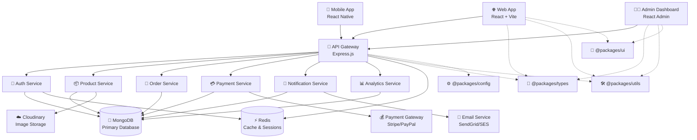
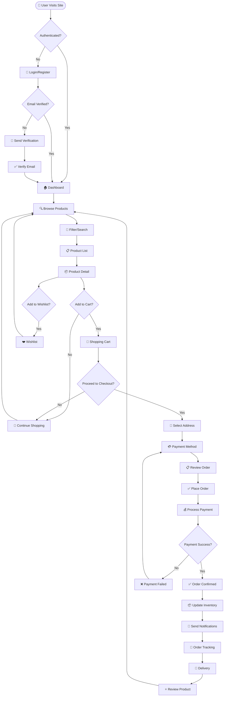
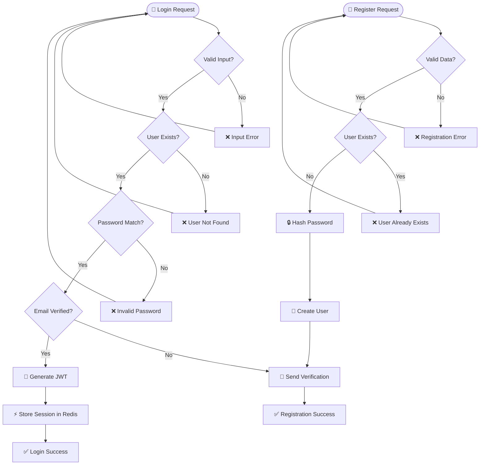
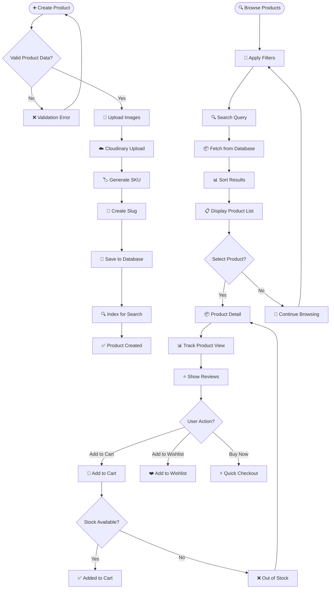
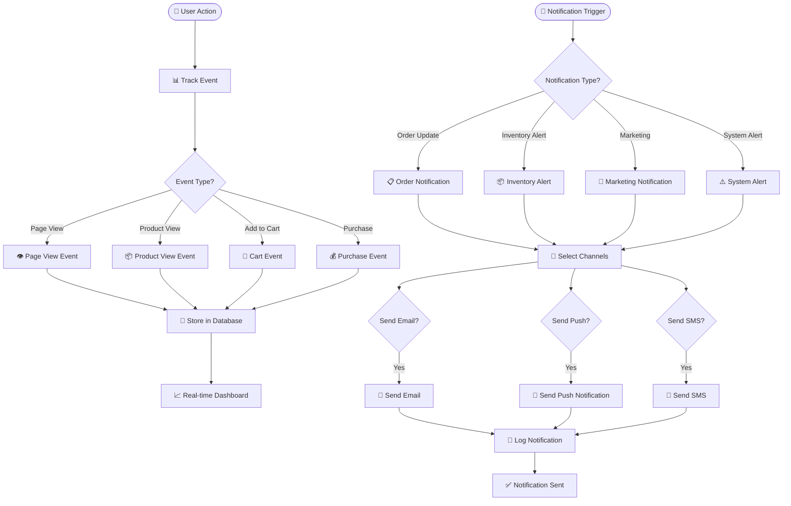
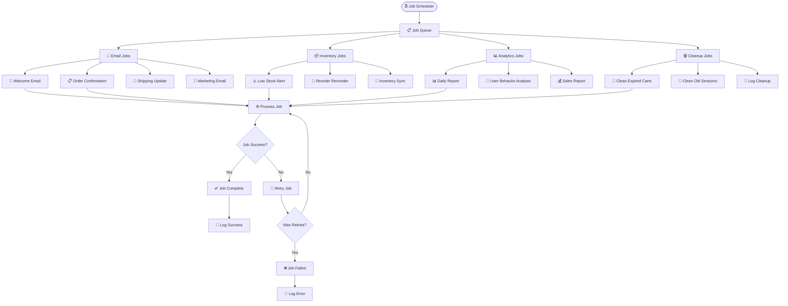

# 🔄 FLOWCHART Inter Medi-A E-Commerce Platform
## Monorepo Architecture Flow

## 🏗️ System Architecture Flow

## 🛒 User Journey Flowchart

## 🔐 Authentication Flow

## 📦 Product Management Flow

## 🛒 Order Processing Flow

```mermaid
flowchart TD
    CHECKOUT_START([🛒 Checkout Process])
    
    %% Pre-checkout Validation
    CHECKOUT_START --> VALIDATE_CART{Cart Valid?}
    VALIDATE_CART -->|No| CART_ERROR[❌ Cart Error]
    VALIDATE_CART -->|Yes| CHECK_INVENTORY{Stock Available?}
    
    CHECK_INVENTORY -->|No| INVENTORY_ERROR[❌ Insufficient Stock]
    CHECK_INVENTORY -->|Yes| SELECT_ADDRESS[📍 Select Address]
    
    %% Address & Shipping
    SELECT_ADDRESS --> CALCULATE_SHIPPING[🚚 Calculate Shipping]
    CALCULATE_SHIPPING --> APPLY_COUPON{Apply Coupon?}
    APPLY_COUPON -->|Yes| VALIDATE_COUPON[🎫 Validate Coupon]
    APPLY_COUPON -->|No| SELECT_PAYMENT[💳 Select Payment]
    
    VALIDATE_COUPON --> COUPON_VALID{Coupon Valid?}
    COUPON_VALID -->|Yes| APPLY_DISCOUNT[💰 Apply Discount]
    COUPON_VALID -->|No| COUPON_ERROR[❌ Invalid Coupon]
    APPLY_DISCOUNT --> SELECT_PAYMENT
    
    %% Payment Processing
    SELECT_PAYMENT --> PAYMENT_GATEWAY[💳 Payment Gateway]
    PAYMENT_GATEWAY --> PROCESS_PAYMENT[💰 Process Payment]
    PROCESS_PAYMENT --> PAYMENT_RESULT{Payment Success?}
    
    PAYMENT_RESULT -->|No| PAYMENT_FAILED[❌ Payment Failed]
    PAYMENT_RESULT -->|Yes| CREATE_ORDER[📋 Create Order]
    
    %% Order Creation
    CREATE_ORDER --> GENERATE_ORDER_NUMBER[🔢 Generate Order Number]
    GENERATE_ORDER_NUMBER --> RESERVE_INVENTORY[📦 Reserve Inventory]
    RESERVE_INVENTORY --> SAVE_ORDER[💾 Save Order]
    SAVE_ORDER --> CLEAR_CART[🗑️ Clear Cart]
    
    %% Post-Order Processing
    CLEAR_CART --> SEND_CONFIRMATION[📧 Send Confirmation Email]
    SEND_CONFIRMATION --> NOTIFY_SELLER[🔔 Notify Seller]
    NOTIFY_SELLER --> UPDATE_ANALYTICS[📊 Update Analytics]
    UPDATE_ANALYTICS --> ORDER_SUCCESS[✅ Order Placed]
    
    %% Order Fulfillment
    ORDER_SUCCESS --> SELLER_PROCESS[👨‍💼 Seller Processing]
    SELLER_PROCESS --> PACK_ORDER[📦 Pack Order]
    PACK_ORDER --> SHIP_ORDER[🚚 Ship Order]
    SHIP_ORDER --> TRACKING_UPDATE[📍 Update Tracking]
    TRACKING_UPDATE --> DELIVERY[🏠 Delivery]
    DELIVERY --> ORDER_COMPLETE[✅ Order Complete]
    
    %% Error Handling
    CART_ERROR --> CHECKOUT_START
    INVENTORY_ERROR --> CHECKOUT_START
    COUPON_ERROR --> SELECT_PAYMENT
    PAYMENT_FAILED --> SELECT_PAYMENT
```

## 📊 Analytics & Notification Flow

## 🔄 Background Jobs Flow

